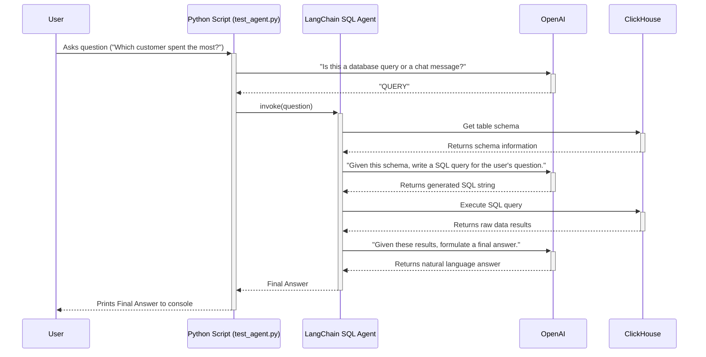

# LangChain & ClickHouse: An Interactive Text-to-SQL Agent

This repository provides a self-contained, interactive demonstration of a Text-to-SQL agent built with Python, LangChain, and ClickHouse. It is designed to serve as a proof-of-concept and a starting point for integrating natural language database queries into applications.

The entire environment is containerized with Docker and is fully configurable via environment variables, ensuring a simple setup and perfect reproducibility.

## ✨ Features

- **Natural Language to SQL:** Ask complex questions about your data in plain English.
- **Intelligent Reasoning:** The agent inspects the database schema to understand table relationships and automatically construct queries with `JOIN`s.
- **ClickHouse Integration:** Demonstrates a direct connection to a high-performance ClickHouse analytical database.
- **Fully Dockerized:** All services are defined in a single `docker-compose.yml` for a one-command setup.
- **Configuration-Driven:** All settings (API keys, database credentials) are managed via a `.env` file for easy setup.
- **Robust Interactive Demo:** The script runs in an interactive loop with several user-friendly features:
  - **Intent Classification:** A pre-processing step uses an LLM to distinguish between database queries and casual conversation, providing helpful guidance to the user.
  - **Graceful Error Handling:** The agent includes self-correction capabilities and user-friendly error messages instead of raw technical tracebacks.
  - **Built-in Help:** A `help` command provides users with example questions to guide them.

---

## 🏛️ Architecture

This project uses a LangChain SQL Agent to orchestrate the process. The agent acts as a reasoning engine, using a Large Language Model (LLM) to understand the user's goal and a toolkit to interact with the database. A preliminary LLM call is used to classify the user's intent before engaging the main agent.

The data flow for a single query is as follows:



---

## 🚀 Getting Started

### Prerequisites

- [Docker](https://www.docker.com/products/docker-desktop/) installed and running on your machine.
- An [OpenAI API Key](https://platform.openai.com/api-keys).

### Step 1: Clone and Configure the Project

1.  **Clone the repository:**

    ```bash
    git clone https://github.com/your-username/langchain-clickhouse-sql-agent.git
    cd langchain-clickhouse-sql-agent
    ```

2.  **Create your environment file from the template:**
    Copy the example file to create your own local configuration.

    ```bash
    cp .env.example .env
    ```

3.  **Edit the `.env` file:**
    Open the newly created `.env` file and add your secret OpenAI API key. The default `CLICKHOUSE` variables are pre-configured for this demo.
    ```
    # .env
    OPENAI_API_KEY="sk-YourSecretOpenAIKeyGoesHere"
    CLICKHOUSE_DB="e_commerce_analytics"
    CLICKHOUSE_USER="default"
    CLICKHOUSE_PASSWORD="learn_password"
    ```

### Step 2: Set Up the ClickHouse Database

Before running the agent, you must start the ClickHouse server and populate it with the test data.

1.  **Start the ClickHouse Server:**
    This command will start the database container in the background. The `e_commerce_analytics` database will be created automatically based on your `.env` configuration.

    ```bash
    docker-compose up -d clickhouse-server
    ```

2.  **Connect to the ClickHouse Client:**
    This opens a command-line interface inside the running container.

    ```bash
    docker-compose exec clickhouse-server clickhouse-client -m
    ```

    _(The `-m` flag allows for pasting multi-line commands.)_

3.  **Run the Setup SQL Commands:**
    Paste each of the following SQL blocks into the client one by one and press Enter to create the tables and insert the sample data.

    - **Create the `customers` table:**

      ```sql
      CREATE TABLE e_commerce_analytics.customers
      (
          `customer_id` UUID,
          `name` String,
          `join_date` Date,
          `country` FixedString(2)
      )
      ENGINE = MergeTree
      ORDER BY (join_date, country);
      ```

    - **Create the `orders` table:**

      ```sql
      CREATE TABLE e_commerce_analytics.orders
      (
          `order_id` UUID,
          `customer_id` UUID,
          `product_name` String,
          `total_price` Decimal(10, 2),
          `order_date` DateTime
      )
      ENGINE = MergeTree
      ORDER BY (order_date, customer_id);
      ```

    - **Insert sample data:**

      ```sql
      -- Customer John Doe
      INSERT INTO e_commerce_analytics.customers VALUES ('00000000-0000-0000-0000-000000000001', 'John Doe', '2025-01-15', 'US');
      INSERT INTO e_commerce_analytics.orders VALUES (generateUUIDv4(), '00000000-0000-0000-0000-000000000001', 'Laptop', 1200.00, '2025-03-20 14:00:00');

      -- Customer Jane Smith (our top spender)
      INSERT INTO e_commerce_analytics.customers VALUES ('00000000-0000-0000-0000-000000000002', 'Jane Smith', '2025-02-10', 'DE');
      INSERT INTO e_commerce_analytics.orders VALUES (generateUUIDv4(), '00000000-0000-0000-0000-000000000002', 'Camera', 950.50, '2025-04-05 11:30:00');
      INSERT INTO e_commerce_analytics.orders VALUES (generateUUIDv4(), '00000000-0000-0000-0000-000000000002', 'Headphones', 250.00, '2025-04-10 09:00:00');

      -- Customer Ahmet Yilmaz
      INSERT INTO e_commerce_analytics.customers VALUES ('00000000-0000-0000-0000-000000000003', 'Ahmet Yilmaz', '2025-03-01', 'TR');
      INSERT INTO e_commerce_analytics.orders VALUES (generateUUIDv4(), '00000000-0000-0000-0000-000000000003', 'Keyboard', 75.25, '2025-05-01 18:00:00');
      ```

4.  **Exit the client** by typing `exit` and pressing Enter. Your database is now ready.

### Step 3: Run the Interactive Demo

1.  **Build the Test Application Image:**

    ```bash
    docker-compose build
    ```

2.  **Run the Interactive Script:**
    This command will start the application and attach your terminal to it, allowing you to type questions.
    ```bash
    docker-compose run -it --rm langchain-test-app
    ```

---

## 💡 How to Use

Once the script is running, you will see a prompt. Ask questions in natural language about the data. The agent is aware of both the `customers` and `orders` tables and can perform JOINs.

Type `help` to see a list of example questions. Type `exit`, `quit`, or `q` to end the session.

**Example Questions:**

- `Which customer spent the most money in total?`
- `How many orders has John Doe placed?`
- `List all products bought by customers from Germany (DE).`
- `What is the total revenue from all approved orders?` (Note: Our sample data has no `status` column, so the agent will correctly tell you it can't answer this).

## 🧹 Cleanup

When you are finished, you can stop all containers and remove the data volume with a single command:

```bash
docker-compose down -v
```
